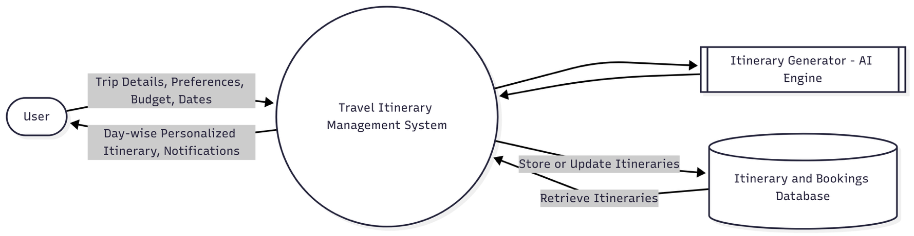
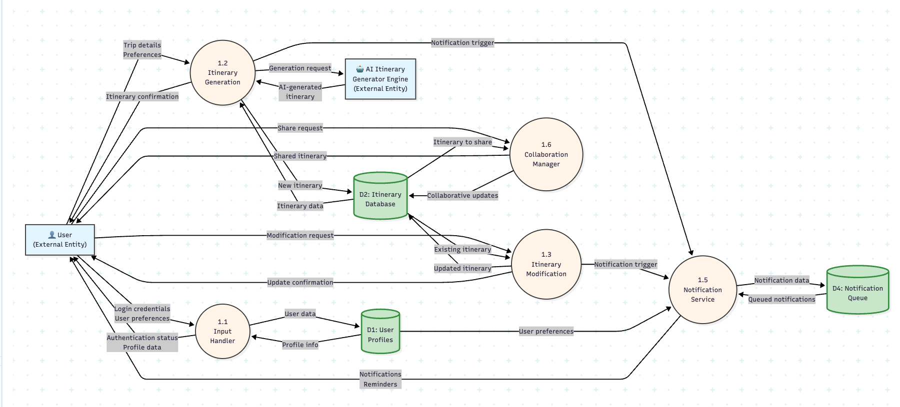
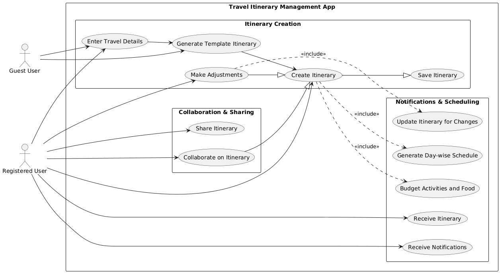
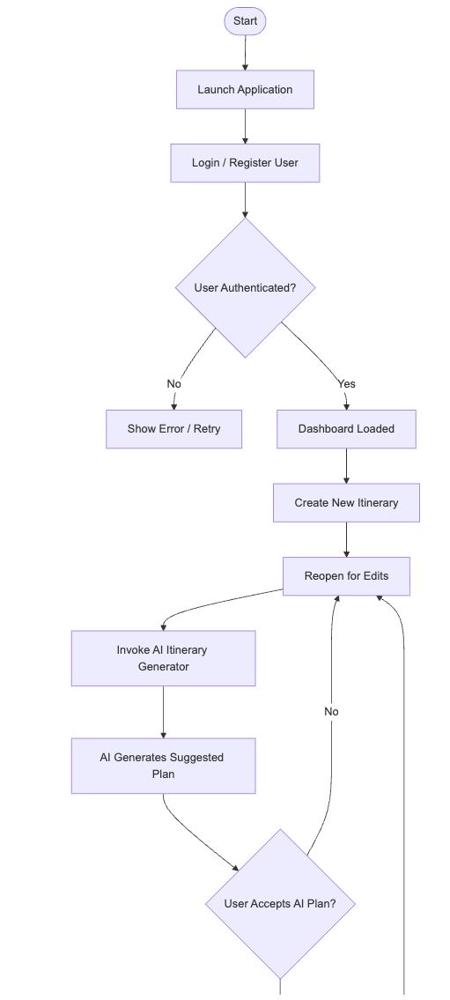
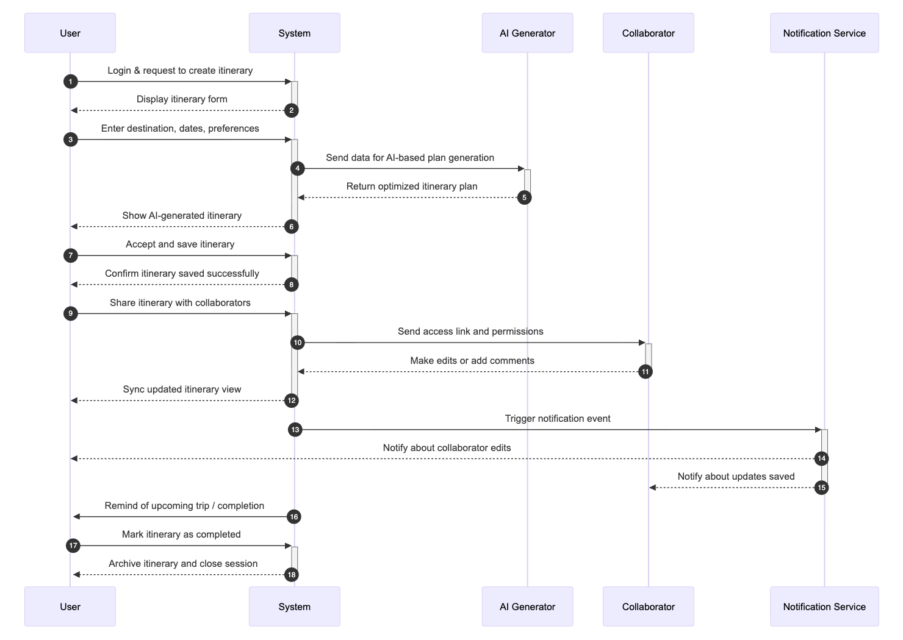
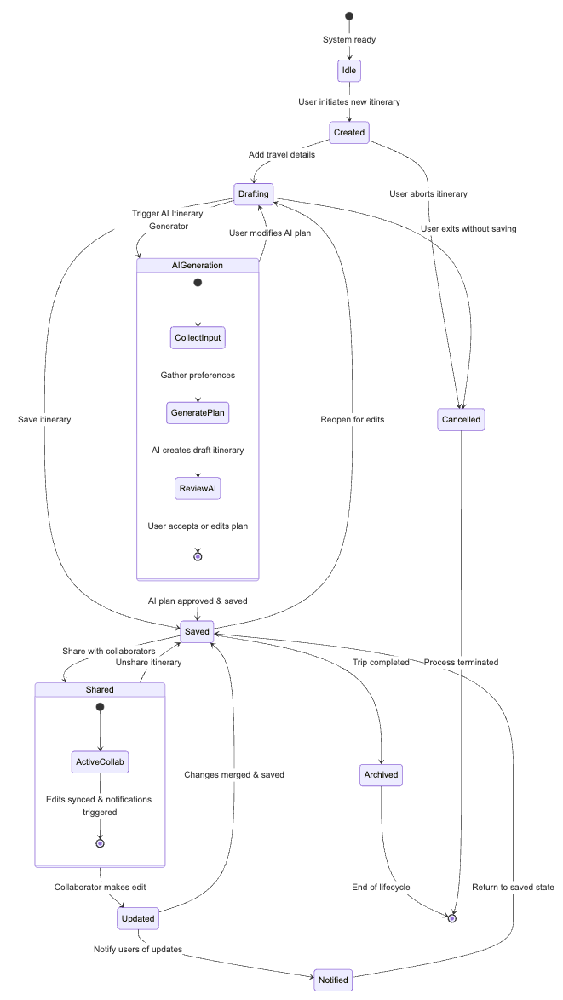
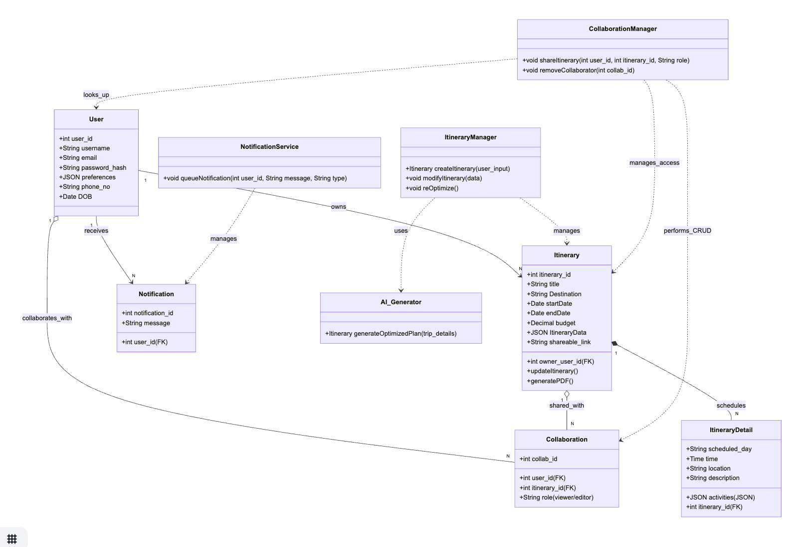
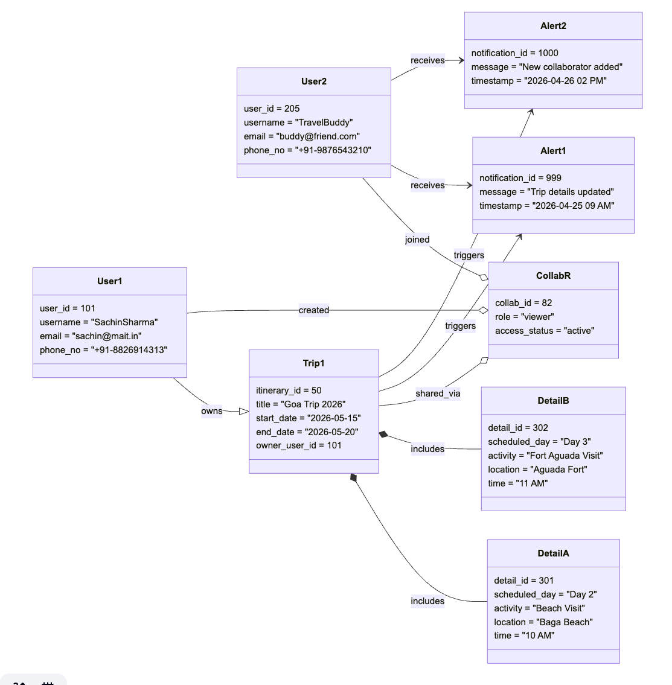
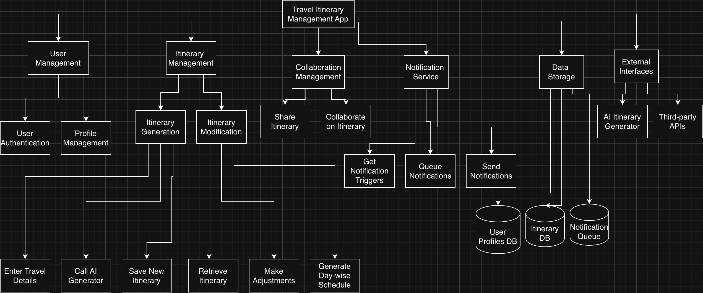
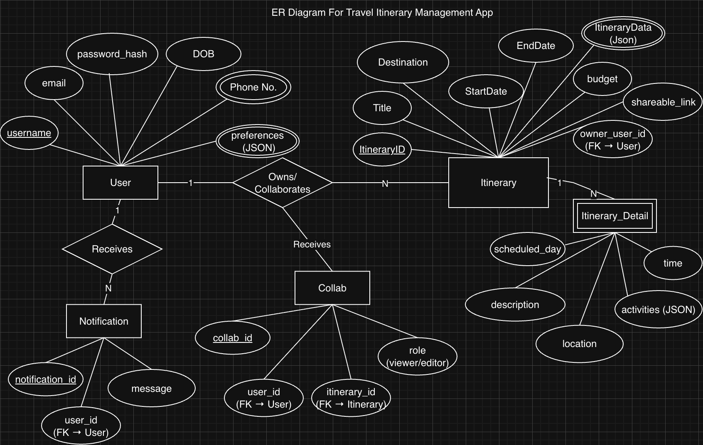

# 📘 Software Engineering Diagrams

This repository contains all diagrams used in the project, arranged **line-wise starting from DFDs**.

---

## 🟦 1. Data Flow Diagrams (DFD)

### **Level 0 DFD**

### **Level 1 DFD**

---

## 🟩 2. Use Case Diagram

---

## 🟨 3. Activity Diagrams

### **Activity Diagram 1**

### **Activity Diagram 2**

---

## 🟧 4. Sequence Diagram

---

## 🟥 5. State Chart Diagram

---

## 🟪 6. Structural View

### **Class Diagram**

### **Object Diagram**

---

## 🟫 7. Structured Charts

---

## 🟦 8. ER Diagram

---

### 📌 **Notes**

- Ensure that all image filenames match exactly (case-sensitive).
- Keep all PNG files in the same directory as this README for correct rendering.
